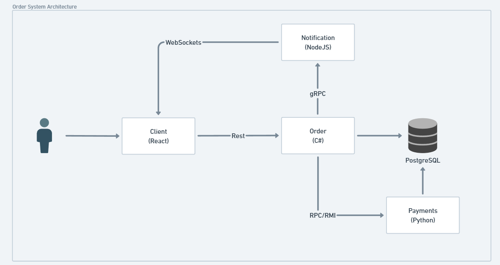

# Distributed Order System

## Introduction
With the increasing demand for distributed systems due to their scalability, performance, and resilience, this project was developed to simulate the behavior of a distributed order system. This document details the development stages of this project.

## DISCLAIMER
This is a study project, so there are some security issues such as hardcoded links and credentials. These could be easily addressed using environment variables and proper security practices in a production environment.

## Conception
Given the project description, we held meetings to analyze the requirements and design an architecture.

The system consists of four main components:
- **Client** - ReactJS
- **Orders** - .NET
- **Payments** - Python
- **Notifications** - NodeJS

Additionally, it implements four communication protocols:
- **REST/SOAP**
- **WebSocket**
- **gRPC**
- **RPC/RMI**

Other requirements include security, containerization, multiple programming languages, scalability, and persistence.

The architecture was designed to establish the best relationship between each component.

In the industry, REST is commonly used for communication between the backend and frontend due to the readability of the JSON format. Therefore, integration between the **Client** and **Orders** was implemented using REST. ReactJS was chosen for the Client component, and .NET for Orders due to familiarity.

Since the **Payments** service only updates the status of an order to simulate payment processing, RPC was chosen as the best method to trigger a single database update. Due to Java's verbosity in setting up an RPC server, Python was chosen for its simplicity.

For **Notifications**, which require real-time transmission, WebSocket and gRPC were ideal due to their bidirectional traffic capabilities. JavaScript (Node.js with Express) was used to take advantage of asynchronous I/O, improving efficiency for handling multiple simultaneous connections.

Docker was used to containerize the application and ease the deployment.

### Architecture Overview


---
## Components Breakdown

### Client Component
The Client component is structured as follows:
- **Components**: Reusable UI elements that may be independent.
- **Hooks**: Manage state and data retrieved from other services.
- **Layout**: Design patterns shared across pages.
- **Pages**: Use layouts, components, and hooks to provide functionality.
- **Services**: Handle API data consumption.
- **App**: Imports all components and runs the application.

Its main role is to provide an intuitive interface, connecting to other components via WebSocket for order updates and making HTTP requests to the Orders API for authentication, user registration, and order management.

### Orders Component
The central communication hub of the system:
- Receives HTTP requests from the frontend.
- Generates authentication tokens.
- Communicates with the database.
- Calls the Payments and Notifications components.

Structure:
- **Controllers**: Entry points for requests.
- **Services**: Business logic and database interactions.
- **Models**: Defines entities and request/response objects.
- **Infra**: Manages external service connections.

### Notifications Component
- Uses **protobuf** to deserialize gRPC data from Orders.
- Initializes a WebSocket server.
- Opens connections and transmits data to connected clients.

### Payments Component
- Receives a function definition (`process_payment`) and a parameter (`order_id`).
- Updates the order status in the database to "Payment Successful".
- Creates a new thread for each request to prevent blocking the main thread, enhancing scalability and availability.

---
## Running the Project
To execute the system, run the following command at the root of the project:
```sh
docker-compose up --build
```
